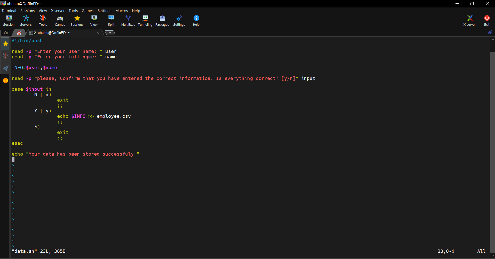
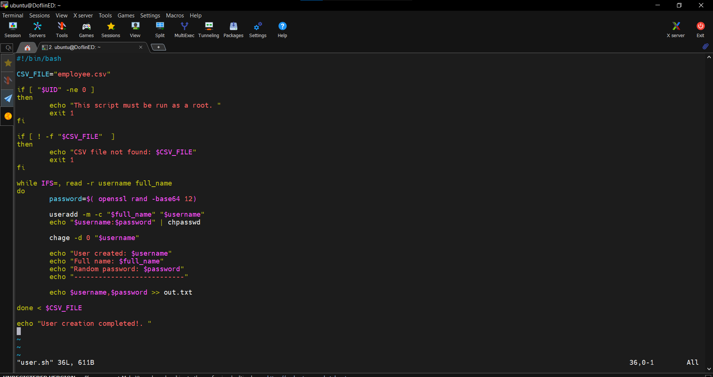
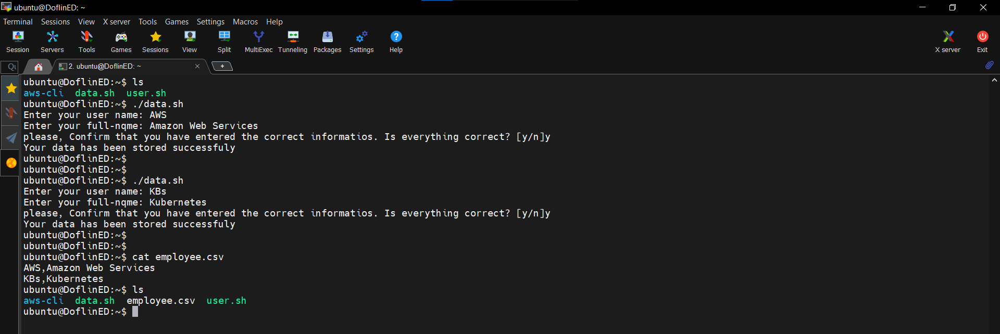
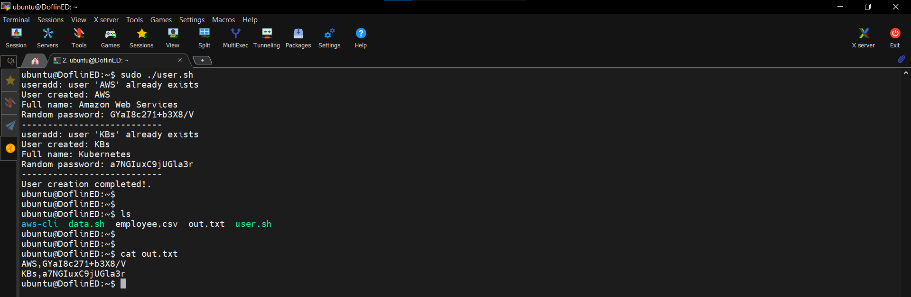
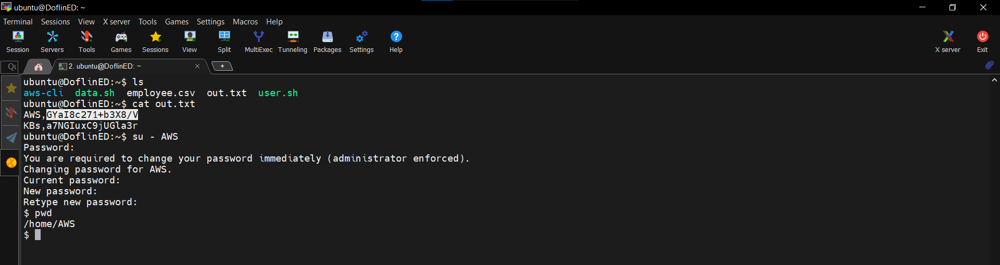
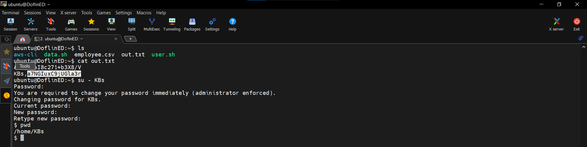
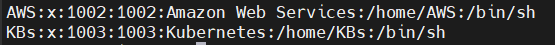

# User Management Automation Project

## Project Summary
Automated the process of creating Linux system users from a CSV file using Bash scripting.
- Developed two Bash scripts: one for collecting user data and another for processing the CSV file to create users.
- Implemented error handling and logging for tracking user creation.
- Verified successful user creation by checking system files.

### Tools Used:
- Bash Scripting
- Linux User Management Commands
- CSV File Handling

---

## Project Description
This project demonstrates how to automate user management on a Linux system using Bash scripts. The project consists of two main scripts:
1. `data.sh`: Collects user data (username and full name) and stores it in a CSV file.
2. `user.sh`: Reads the CSV file and creates users on the system.

---

## Project Architecture
The automation consists of:
- **Data Collection Script (`data.sh`)**: Reads username and full name from the user and saves them in `employee.csv`.
- **User Creation Script (`user.sh`)**: Reads `employee.csv` and creates users in the system, generating `out.txt` with usernames and passwords.
- **Verification Steps**: Includes checking file contents and system user lists.

---

## Project Explanation

1. **User Data Collection**
   - The script `data.sh` prompts for a username and full name.
   - The entered data is stored in `employee.csv`.
   
   

2. **Processing the CSV File and Creating Users**
   - The script `user.sh` reads `employee.csv` and creates users.
   - A password is assigned to each user, and details are logged in `out.txt`.
   
   

3. **Executing the Data Collection Script (`data.sh`)**
   - Running `data.sh` multiple times for two users (AWS and KBs), followed by viewing `employee.csv` using `cat` to confirm data entry.
   
   

4. **Executing the User Creation Script (`user.sh`)**
   - Running `user.sh`, displaying the files, showing `out.txt`, and using `cat` to view the content of `out.txt`.
   
   

5. **Logging in with Created Users**
   - User `AWS` logs in successfully, as seen in `out.txt` and verified by using `su - AWS`.
   
   
   
   - User `KBs` logs in successfully, as seen in `out.txt` and verified by using `su - KBs`.
   
   

6. **Verifying User Creation**
   - The `/etc/passwd` file is inspected to confirm user creation.
   
   

---

## How to Use
1. Clone this repository:
   ```bash
   git clone https://github.com/SaaedT/User-Account-Management-Script.git
   ```
2. Navigate to the project directory:
   ```bash
   cd User-Account-Management-Script
   ```
3. Run the data collection script:
   ```bash
   ./data.sh
   ```
4. Run the user creation script:
   ```bash
   sudo ./user.sh
   ```
5. Verify user creation:
   ```bash
   cat /etc/passwd | grep "AWS"
   ```
6. Log in with a created user:
   ```bash
   su - AWS
   ```
